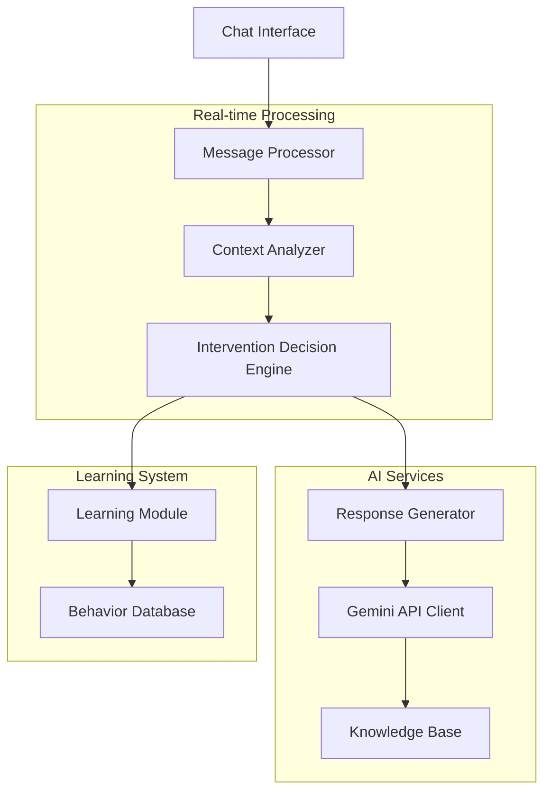

# Design Document

## Overview

The Proactive Brainstorm Bot is a real-time chat monitoring system that uses the Gemini API to intelligently decide when to intervene in VC boardroom conversations. The system employs a multi-layered decision engine that analyzes conversation context, timing, and relevance to determine optimal intervention points without being disruptive.

## Architecture

### Core Components



### System Flow

1. **Message Ingestion**: Real-time chat messages are captured and queued
2. **Context Analysis**: Each message is analyzed for topic relevance, sentiment, and conversation flow
3. **Intervention Assessment**: Decision engine determines if and when to respond
4. **Response Generation**: If intervention is warranted, appropriate response is crafted
5. **Learning Integration**: User reactions and conversation outcomes inform future decisions

## Components and Interfaces

### 1. Message Processor

**Purpose**: Handles incoming chat messages and prepares them for analysis

```typescript
interface MessageProcessor {
  processMessage(message: ChatMessage): ProcessedMessage;
  maintainConversationHistory(messages: ChatMessage[]): ConversationContext;
  detectConversationPauses(): boolean;
}

interface ChatMessage {
  id: string;
  userId: string;
  content: string;
  timestamp: Date;
  metadata?: MessageMetadata;
}

interface ProcessedMessage {
  originalMessage: ChatMessage;
  extractedEntities: Entity[];
  sentiment: SentimentScore;
  topicClassification: TopicCategory[];
  urgencyLevel: UrgencyLevel;
}
```

### 2. Context Analyzer

**Purpose**: Analyzes conversation context using Gemini API to understand discussion state with enhanced topic drift detection

```typescript
interface ContextAnalyzer {
  analyzeConversationFlow(history: ProcessedMessage[]): FlowAnalysis;
  detectTopicDrift(messages: ProcessedMessage[]): TopicDriftResult;
  identifyInformationGaps(context: ConversationContext): InformationGap[];
  assessConversationHealth(): ConversationHealth;
  calculateDriftUrgency(driftResult: TopicDriftResult): UrgencyLevel;
  generateRedirectionStrategy(originalTopic: string, currentTopic: string): RedirectionStrategy;
}

interface FlowAnalysis {
  currentTopic: string;
  topicStability: number; // 0-1 score
  participantEngagement: EngagementMetrics;
  conversationMomentum: MomentumIndicator;
  messagesOffTopic: number;
  interventionRecommended: boolean;
}

interface TopicDriftResult {
  isDrifting: boolean;
  originalTopic: string;
  currentDirection: string;
  driftSeverity: number; // 0-1 score
  messagesOffTopic: number;
  suggestedRedirection?: string;
  urgencyLevel: UrgencyLevel;
  shouldInterventImmediately: boolean;
}

interface RedirectionStrategy {
  approach: RedirectionApproach;
  message: string;
  contextSummary: string;
  diplomaticLevel: number; // 0-1 score for how gentle to be
}

enum RedirectionApproach {
  GENTLE_REMINDER = 'gentle_reminder',
  CONTEXT_SUMMARY = 'context_summary',
  DIRECT_REDIRECT = 'direct_redirect',
  AGENDA_REFERENCE = 'agenda_reference'
}
```

### 3. Intervention Decision Engine

**Purpose**: Core logic for determining when and how to intervene proactively with enhanced topic focus protection

```typescript
interface InterventionDecisionEngine {
  shouldIntervene(
    context: ConversationContext,
    analysis: FlowAnalysis,
    userPreferences: UserPreferences
  ): InterventionDecision;
  
  calculateInterventionTiming(
    decision: InterventionDecision,
    conversationState: ConversationState
  ): TimingStrategy;
  
  adaptBehaviorFromFeedback(
    feedback: UserFeedback,
    interventionHistory: InterventionRecord[]
  ): BehaviorAdjustment;
  
  evaluateTopicDriftUrgency(driftResult: TopicDriftResult): InterventionUrgency;
  determineSummonResponseType(summonContext: SummonContext): ResponseType;
}

interface InterventionDecision {
  shouldRespond: boolean;
  interventionType: InterventionType;
  confidence: number; // 0-1 score
  reasoning: string;
  priority: Priority;
  isProactive: boolean;
  requiresImmediateAction: boolean;
}

interface SummonContext {
  hasExplicitQuestion: boolean;
  questionClarity: number; // 0-1 score
  requiresClarification: boolean;
  directResponsePossible: boolean;
}

enum ResponseType {
  DIRECT_ANSWER = 'direct_answer',
  CLARIFICATION_NEEDED = 'clarification_needed',
  INFORMATION_REQUEST = 'information_request'
}

enum InterventionType {
  TOPIC_REDIRECT = 'topic_redirect',
  INFORMATION_PROVIDE = 'information_provide',
  FACT_CHECK = 'fact_check',
  CLARIFICATION_REQUEST = 'clarification_request',
  SUMMARY_OFFER = 'summary_offer',
  PROACTIVE_FOCUS = 'proactive_focus'
}
```

### 4. Response Generator

**Purpose**: Crafts contextually appropriate responses using Gemini API with professional communication standards

```typescript
interface ResponseGenerator {
  generateResponse(
    interventionType: InterventionType,
    context: ConversationContext,
    additionalData?: any
  ): Promise<BotResponse>;
  
  personalizeResponse(
    baseResponse: string,
    userPreferences: UserPreferences,
    conversationTone: ConversationTone
  ): string;
  
  ensureProfessionalTone(response: string): string;
  removeRoboticPhrases(response: string): string;
  validateBusinessLanguage(response: string): ValidationResult;
}

interface BotResponse {
  content: string;
  type: InterventionType;
  confidence: number;
  sources?: Source[];
  followUpSuggestions?: string[];
  communicationStyle: CommunicationStyle;
}

interface ValidationResult {
  isValid: boolean;
  issues: string[];
  suggestions: string[];
}
```

### 5. Learning Module

**Purpose**: Continuously improves proactive behavior based on user interactions

```typescript
interface LearningModule {
  recordInterventionOutcome(
    intervention: InterventionRecord,
    userReaction: UserReaction,
    conversationOutcome: ConversationOutcome
  ): void;
  
  updateInterventionThresholds(
    userId: string,
    feedbackHistory: FeedbackRecord[]
  ): ThresholdAdjustments;
  
  identifySuccessPatterns(): InterventionPattern[];
}
```

## Data Models

### Core Data Structures

```typescript
interface ConversationContext {
  sessionId: string;
  participants: Participant[];
  currentTopic: string;
  agenda?: AgendaItem[];
  messageHistory: ProcessedMessage[];
  interventionHistory: InterventionRecord[];
  startTime: Date;
  meetingType: MeetingType;
}

interface Participant {
  id: string;
  name: string;
  role: VCRole;
  preferences: UserPreferences;
  engagementLevel: number;
}

enum VCRole {
  PARTNER = 'partner',
  PRINCIPAL = 'principal',
  ANALYST = 'analyst',
  ENTREPRENEUR = 'entrepreneur',
  GUEST = 'guest'
}

interface UserPreferences {
  interventionFrequency: InterventionFrequency;
  preferredInformationTypes: InformationType[];
  communicationStyle: CommunicationStyle;
  topicExpertise: ExpertiseArea[];
}

interface InterventionRecord {
  id: string;
  timestamp: Date;
  type: InterventionType;
  trigger: string;
  response: string;
  userReaction?: UserReaction;
  effectiveness?: EffectivenessScore;
}
```

## Professional Communication Standards

### Response Quality Assurance

The system implements multiple layers of quality control to ensure professional, natural communication:

#### 1. Robotic Phrase Detection and Removal
```typescript
interface CommunicationFilter {
  detectRoboticPhrases(text: string): RoboticPhrase[];
  removeEchoingPatterns(text: string, userInput: string): string;
  enhanceNaturalFlow(text: string): string;
}

// Prohibited patterns that trigger rewriting:
const ROBOTIC_PATTERNS = [
  /^Based on your question about/i,
  /^According to your request/i,
  /^As per your inquiry/i,
  /^In response to your question about/i,
  /What do you need\?$/i
];
```

#### 2. Executive-Level Language Standards
- **Tone**: Confident, knowledgeable, concise
- **Vocabulary**: Business-appropriate, avoiding technical jargon unless necessary
- **Structure**: Clear, actionable, with supporting evidence when relevant
- **Personality**: Professional but approachable, like a senior analyst

#### 3. Context-Aware Response Adaptation
```typescript
interface ResponseAdapter {
  adaptToMeetingContext(response: string, meetingType: MeetingType): string;
  adjustForParticipantRoles(response: string, participants: Participant[]): string;
  maintainConversationalFlow(response: string, conversationTone: ConversationTone): string;
}
```

### Topic Focus Protection

#### Enhanced Drift Detection Algorithm
- **Threshold**: 2 consecutive off-topic messages (reduced from 3)
- **Scoring**: Investment relevance score 0-1, with <0.6 triggering concern
- **Context Preservation**: Maintains summary of original discussion for redirection

#### Proactive Intervention Strategy
```typescript
interface FocusProtection {
  monitorTopicRelevance(messages: ProcessedMessage[]): RelevanceScore;
  generateDiplomaticRedirection(context: ConversationContext): RedirectionMessage;
  preserveGroupDynamics(intervention: InterventionMessage): InterventionMessage;
}

interface RedirectionMessage {
  approach: 'gentle' | 'contextual' | 'direct';
  message: string;
  originalTopicSummary: string;
  transitionPhrase: string;
}
```

## Error Handling

### API Resilience
- **Gemini API Failures**: Implement exponential backoff and fallback to cached responses
- **Rate Limiting**: Queue management with priority-based processing
- **Network Issues**: Offline mode with basic rule-based interventions

### Conversation Handling
- **Ambiguous Context**: Request clarification rather than making assumptions
- **Conflicting Information**: Present multiple perspectives and sources
- **Inappropriate Content**: Graceful deflection with professional tone

### Learning System Errors
- **Insufficient Data**: Use conservative intervention thresholds until patterns emerge
- **Contradictory Feedback**: Weight recent feedback more heavily than historical data
- **Edge Cases**: Log unusual patterns for manual review and system improvement

## Testing Strategy

### Unit Testing
- **Message Processing**: Test entity extraction, sentiment analysis, topic classification
- **Decision Engine**: Verify intervention logic with various conversation scenarios
- **Response Generation**: Validate response appropriateness and tone consistency

### Integration Testing
- **Gemini API Integration**: Test API calls, error handling, and response processing
- **Real-time Processing**: Verify message flow and timing accuracy
- **Learning System**: Test feedback incorporation and behavior adaptation

### User Acceptance Testing
- **Proactive Behavior**: Simulate VC conversations to validate intervention timing
- **Information Accuracy**: Verify fact-checking and data provision capabilities
- **User Experience**: Test bot personality and communication effectiveness

### Performance Testing
- **Real-time Response**: Ensure sub-second analysis and decision-making
- **Concurrent Sessions**: Test multiple simultaneous conversations
- **Learning Scalability**: Validate system performance as data volume grows

### A/B Testing Framework
- **Intervention Strategies**: Compare different proactive approaches
- **Response Styles**: Test formal vs. conversational communication
- **Timing Algorithms**: Optimize intervention timing based on user satisfaction